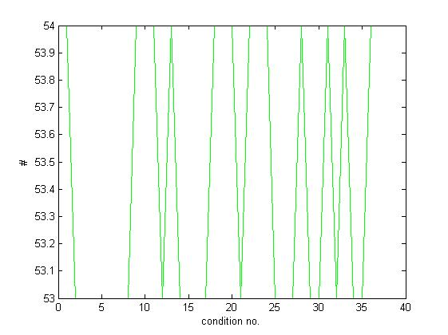
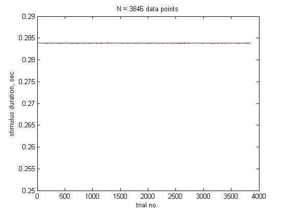
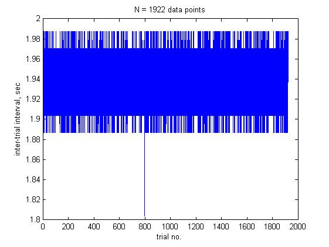
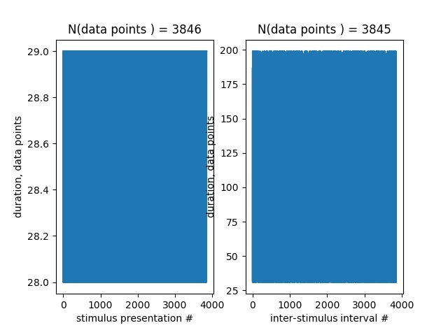

<b>Step 1.</b> Run the Matlab script <a href='https://github.com/departutto/mouse_locomotion/blob/master/data%20retrieval%20and%20PSTHs/acquire_trials.m'>'acquire_trials.m'</a> to retrieve the experiment data.

<ul>
<li>Open Matlab Editor by typing in 'edit' in the Matlab command line.</li>
<li>Open script 'acquire_trials.m' in the Matlab Editor.</li>
<li>Make block no. 1 active and execute it (Cell -> Evaluate Current Cell or Ctrl + Enter).</li>
<li>Make block no. 2 active and execute it (Cell -> Evaluate Current Cell or Ctrl + Enter). 
<i>Script output: Events file: Events.nev</i> 
<i>Script output: Block no. 2 was complete.</i></li>
<li>Make block no. 3 active and execute it (Cell -> Evaluate Current Cell or Ctrl + Enter). 
<i>Script output: Situation #1: Header start and stop indices = 5690 x 5697</i></li>
<li>Remove one record from the data structure 'consolidated' by typing in the following instruction. 
<i>>> consolidated = [consolidated(1:5690, :); consolidated(5692:end, :)];</i> 
<li>Make block no. 3 active and execute it (Cell -> Evaluate Current Cell or Ctrl + Enter). 
<i>Script output: Situation #1: Header start and stop indices = 32229 x 32236</i></li>
<li>Remove one record from the data structure 'consolidated' by typing in the following instruction. 
<i>>> consolidated = [consolidated(1:32229, :); consolidated(32231:end, :)];</i></li>
<li>Make block no. 3 active and execute it (Cell -> Evaluate Current Cell or Ctrl + Enter). 
<i>Script output: N(Header start and stop entries) = 1923 x 1923</i> 
<i>Block no. 3 was complete.</i></li>
<li>Make block no. 4 active and execute it (Cell -> Evaluate Current Cell or Ctrl + Enter). 
<i>Block no. 4 was complete.</i></li>
<li>Make block no. 5 active and execute it (Cell -> Evaluate Current Cell or Ctrl + Enter). 
<i>Unique conditions = [1   2   3   4   5   6   7   8   9  10  11  12  13  14  15  16  17  18  19  20  21  22  23  24  25  26  27  28  29  30  31  32  33  34  35  36]</i> 
<i>Block no. 5 was complete.</i> 
</li>
<li>Make block no. 6 active and execute it (Cell -> Evaluate Current Cell or Ctrl + Enter). 
<i>Block no. 6 was complete.</i> 
</li>
<li>Make block no. 7 active and execute it (Cell -> Evaluate Current Cell or Ctrl + Enter). 
<i>Block no. 7 was complete.</i> 
</li>
<li>Save the variables 'consolidated', 'time0', and 'trials' in a file (e.g., >> save '2018-05-08-mouse-68865-run-01.mat').</li>
<li>Clear the Matlab workspace by typing in 'clear all' in the Matlab command line.</li>
</ul>
<b>Note!</b> Usually the 1st retrieved trial is corrupted. For this reason I recommend to remove it by typing in 'trials = trials(2:end)' in the Matlab command line and use this new edited data
structure for any further data analysis.  

<b>Step 2.</b> After you retrieved the experiment information, next explore statistics on the locomotion signal. To do this, run the Python script 
<a href='https://github.com/departutto/mouse_locomotion/blob/master/running%20wheel/data%20analysis/get_statistics.py'>'get_statistics.py'</a> stored in the folder 
<a href='https://github.com/departutto/mouse_locomotion/tree/master/running%20wheel/data%20analysis'>'./running wheel/data analysis/'</a> in the Windows command line (cmd) as follows:  
<i>In the Windows command line: > python get_statistics.py locomotion.txt</i> 
<i>Script output: Successfully processed: locomotion.txt</i> 
<i>Script output: Total number of the retrieved data points is 545902.</i> 
<i>Script output: Out of those, 545902 points are proper real numbers.</i> 
<i>Script output: We used 1.00 cm/sec as the threshold to detect locomotion.</i> 
<i>Script output: The number of data points above the threshold is 185453 (33.97%).</i> 
<i>Script output: The number of data points below the threshold is 360449 (66.03%).</i> 
<i>Script output: The average locomotion speed is 5.67 cm/sec.</i> 
<i>Script output: The median locomotion speed is 3.80 cm/sec.</i> 
<i>Script output: The 25th-75th percentiles of the locomotion speed are [ 1.3  8.9] cm/sec.</i> 
<i>Script output: The standard deviation of the locomotion speed is 4.91 cm/sec.</i> 
<i>Script output: The maximum locomotion speed detected is 34.40 cm/sec.</i> 

<b>Step 3.</b> You next split the locomotion signal per stimulus presentation by running the Python script 
<a href='https://github.com/departutto/mouse_locomotion/blob/master/running%20wheel/data%20analysis/split_per_presentation.py'>'split_per_presentation.py'</a> in the Windows command line (cmd). 
The script is stored in the folder <a href='https://github.com/departutto/mouse_locomotion/tree/master/running%20wheel/data%20analysis'>'./running wheel/data analysis/'</a>.  
<i>In the Windows command line: > split_per_presentation.py locomotion.txt</i> 
<i>Script output: Filename = locomotion.txt</i> 
<i>Script output: N(data points) = 545902</i> 
<i>Script output: N(corrupted) = 0</i> 
  
