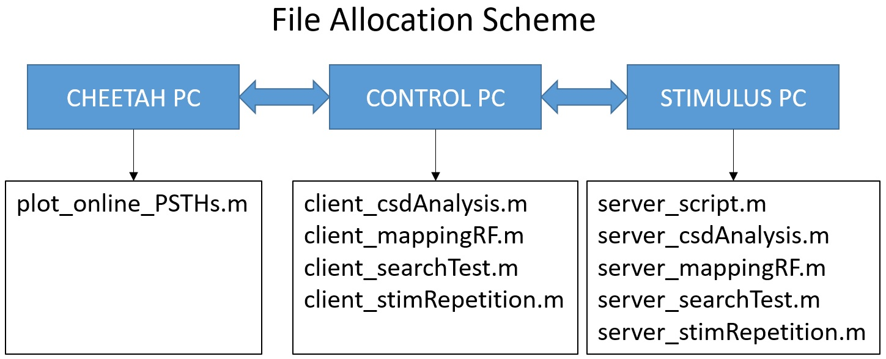
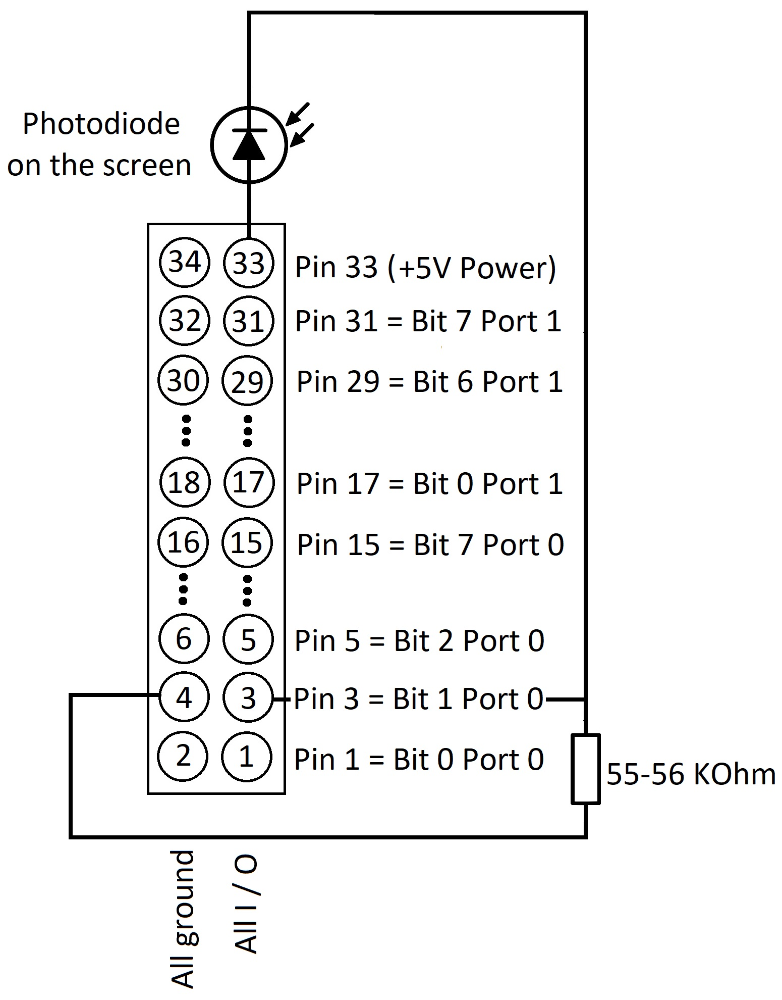

 <i>Last modified on May 4, 2018.</i>

 
 All Matlab files in the folder should be distributed among the setup computers according to the following scheme:  
 
   
 
 List of the Matlab files:
 
 <ul>
 
 <li><b>Run on the Cheetah PC:</b></li>
   <ul>
     <li><i>plot_online_PSTHs.m</i> - plots on-line PSTHs for channel 'acq_entity' for the maximum of 'n_rows' x 'n_columns' stimulus
     conditions (see script). The actual number of stimulus conditions used in a particular test must not exceed the maximum allowed
     number set in this script.</li>
   </ul>
   
 <li><b>Run on the Control PC:</b></li>
   <ul>
     <li><i>client_csdAnalysis.m</i> - presentation of full-screen flashing checkerboards.</li> 
     <li><i>client_mappingRF.m</i> - presentation of a single white square on the black background at the predetermined positions evenly
     distributed across the screen.</li>
     <li><i>client_searchTest.m</i> - presentation of a random sequence of stimuli at a specified position on the screen; only one 
     stimulus is presented at a time, and any two consecutive stimuli are separated by a blank screen.</li>
     <li><i>client_stimRepetition.m</i> - presentation of stimulus repetitions (e.g., X->X) and stimulus alternations (e.g., Y->X); each
     of the two stimuli is presented at the same position and for the same time, and the two stimuli are separated by a blank screen.</li>
   </ul>
   
 <li><b>Run on the Stimulus PC:</b></li>
   <ul>
     <li><i>server_script.m</i> - must be run first; switches between different tests and communicates specific experiment settings
     into those tests.</li>
     <li><i>server_csdAnalysis.m</i> - implementation of stimulus presentation for <i>client_csdAnalysis.m</i>.</li>
     <li><i>server_mappingRF</i> - implementation of stimulus presentation for <i>client_mappingRF.m</i>.</li>
     <li><i>server_searchTest.m</i> - implementation of stimulus presentation for <i>client_searchTest.m</i>.</li>
     <li><i>server_stimRepetition.m</i> - implementation of stimulus presentation for <i>client_stimRepetition.m</i>.</li>
   </ul>
   
 </ul> 
 
 Notes: 
 <ul>
   <li>When creating a new test, you will have to create two separate Matlab scripts: one to provide a graphical user interface on the 
   Control PC (e.g., <i>client_newtest.m</i>), and another one to implement actual stimulus presentation on the Stimulus PC (e.g.,
   <i>server_newtest.m</i>).</li>
   <li>File <i>client_newtest.m</i> incorporates the experiment settings and is almost identical to any other similar file.</li>
   <li>First, you need to launch <i>server_script.m</i> on the Stimulus PC, and only after that you can launch your test (e.g., 
   <i>client_mytest.m)</i>.</li>
   <li>To initiate stimulus presentation, push button 'Start test' in the graphical user interface on the Control PC, and 'Stop test'
   otherwise.</li>
   <li>At the end of your training/recordings session, push button 'Stop server' to halt <i>server_script.m</i> running on the Stimulus
   PC and to be able to quit Matlab afterwards.</li>
   <li>When modifying an existing test, it is strongly recommended to copy the files of that test (e.g., <i>client_mytest.m</i>, <i>
   server_mytest.m</i>), rename them according to your needs (e.g., <i>client_mytest_version2.m</i>, <i>server_mytest_version2.m</i>)
   and work further only with the copied files.</li>
 </ul> 
 
 Connection scheme between the Cheetah Data Acquisition box and a photodiode attached to the screen of Stimulus PC:  
 
