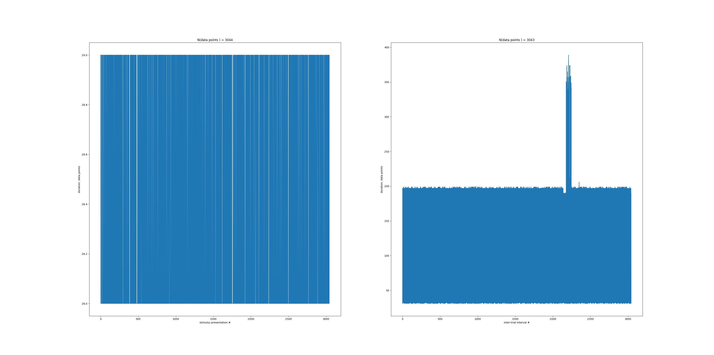

<i>Last updated on May 3, 2018.</i>

Scripts: 
<ul>
<li>
<b>get_statistics.py</b> - provides statistics on the locomotion signal.  
<b>Example (in the command line).</b>  >> python get_statistis.py data_file.txt 
Successfully processed: data_file.txt 
Total number of the retrieved data points is 437601. 
Out of those, 437601 points are proper real numbers. 
We used 1.00 cm/sec as the threshold to detect locomotion. 
The number of data points above the threshold is 371443 (84.88%). 
The number of data points below the threshold is 66158 (15.12%). 
The average locomotion speed is 18.32 cm/sec. 
The median locomotion speed is 18.00 cm/sec. 
The 25th-75th percentiles of the locomotion speed are [ 10.2  26.8] cm/sec. 
The standard deviation of the locomotion speed is 9.81 cm/sec. 
The maximum locomotion speed detected is 48.70 cm/sec. 
</li>
 
<li>
<b>split_per_presentation.py</b> - splits the locomotion signal per stimulus presentation.  
<b>Example (in the command line).</b>  >> python split_per_presentation.py data_file.txt 
Filename = data_file.txt 
N(data points) = 437601 
N(corrupted) = 0  
<b>Output.</b>
<ul>
<li>Matlab file data_file.txt.m that contains the locomotion signal per stimulus presentation.</li>
<li>Figure file data_file.txt.jpg that shows duration of stimulus presentations and inter-trial intervals. 
Note that a single trial is assumed to consist of two stimulus presentations. </li>
</ul>
</li>
</ul>
